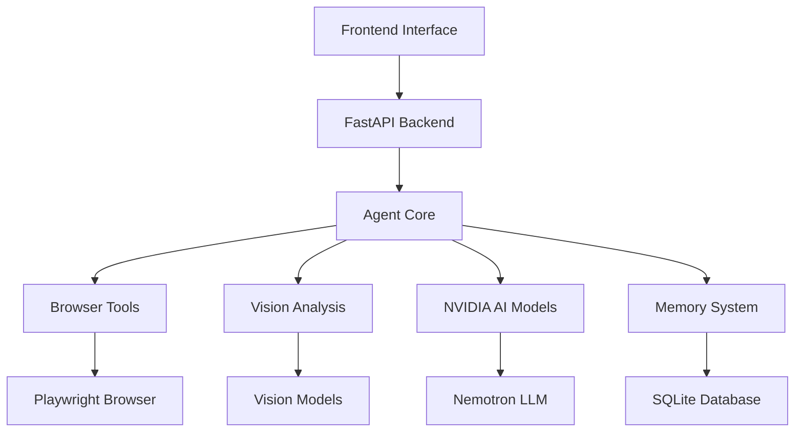

# 🤖 Multimodal Web Research Intelligence Agent

A cutting-edge AI-powered research agent that combines web browsing, screenshot analysis, and NVIDIA's advanced AI models to provide comprehensive multimodal research insights.


## 🌟 Features

### 🧠 Advanced AI Capabilities
- **NVIDIA Nemotron Integration**: Leverages NVIDIA's latest LLM models for advanced reasoning
- **Vision Analysis**: Screenshot analysis using NVIDIA Vision models
- **Multimodal Understanding**: Combines text and visual content for comprehensive insights

### 🌐 Web Research Automation
- **Intelligent Browsing**: Automated web navigation with Playwright
- **Content Extraction**: Smart text extraction and cleaning
- **Screenshot Capture**: Automatic visual content capture
- **Multi-URL Processing**: Parallel processing of multiple sources

### 💾 Session Management
- **Memory System**: Persistent storage of research sessions
- **Search History**: Query tracking and suggestions
- **User Preferences**: Customizable settings and preferences

### 🎨 Modern Interface
- **Beautiful UI**: Responsive, modern web interface
- **Real-time Updates**: Live progress tracking
- **Interactive Results**: Rich formatting and source attribution

## 🏗️ Architecture



## 🚀 Quick Start

### Prerequisites
- Python 3.8+
- Node.js (for Playwright)
- NVIDIA API Access (for full functionality)

### Installation

1. **Clone the repository:**
```bash
git clone <repository-url>
cd multimodal-browser-agent
```

2. **Install Python dependencies:**
```bash
pip install -r requirements.txt
```

3. **Install Playwright browsers:**
```bash
playwright install
```

4. **Configure environment variables:**
```bash
cp .env.example .env
# Edit .env with your NVIDIA API credentials
```

5. **Start the application:**
```bash
python -m uvicorn app.main:app --reload --host 0.0.0.0 --port 8000
```

6. **Access the interface:**
- Web UI: http://localhost:8000
- API Documentation: http://localhost:8000/docs
- Health Check: http://localhost:8000/health

## ⚙️ Configuration

### Environment Variables

Create a `.env` file with the following configurations:

```env
# NVIDIA API Configuration
NVIDIA_API_KEY=your_nvidia_nim_api_key_here
NVIDIA_VISION_ENDPOINT=https://your-vision-api-endpoint.com/api/v1/vision
NIM_ENDPOINT=https://your-nim-endpoint.com/api/v1/generate

# Database Configuration
DATABASE_URL=sqlite:///./agent_memory.db

# FastAPI Configuration
API_HOST=0.0.0.0
API_PORT=8000
DEBUG=True

# Browser Configuration
HEADLESS_BROWSER=True
BROWSER_TIMEOUT=30000
```

### NVIDIA API Setup

1. **Get API Access:**
   - Visit [NVIDIA Developer](https://developer.nvidia.com/)
   - Sign up for NIM (NVIDIA Inference Microservices) access
   - Obtain your API key

2. **Configure Endpoints:**
   - Update `NVIDIA_API_KEY` with your API key
   - Set `NIM_ENDPOINT` to your NIM service URL
   - Configure `NVIDIA_VISION_ENDPOINT` for vision capabilities

## 🔧 API Reference

### Research Endpoint

**POST** `/agent/research`

Perform multimodal web research on provided URLs.

```json
{
  "query": "What are the latest AI trends?",
  "urls": [
    "https://example.com/ai-news",
    "https://example.com/tech-trends"
  ],
  "max_tokens": 512,
  "include_screenshots": true
}
```

**Response:**
```json
{
  "result": "Comprehensive analysis results...",
  "sources_analyzed": ["https://example.com/ai-news"],
  "vision_insights": ["Screenshot analysis results..."],
  "processing_time": 15.2,
  "timestamp": "2024-01-15T10:30:00Z"
}
```

### Vision Analysis Endpoint

**POST** `/agent/vision`

Analyze uploaded images using NVIDIA vision models.

- Upload image file
- Optional query parameter for targeted analysis

### Health Check

**GET** `/health`

Check system health and service status.

## 🧪 Usage Examples

### Basic Research Query

```python
import requests

response = requests.post("http://localhost:8000/agent/research", json={
    "query": "Compare the latest GPU architectures from NVIDIA",
    "urls": [
        "https://www.nvidia.com/en-us/geforce/graphics-cards/",
        "https://www.nvidia.com/en-us/data-center/a100/"
    ],
    "max_tokens": 1024,
    "include_screenshots": True
})

results = response.json()
print(results["result"])
```

### Image Analysis

```python
import requests

with open("screenshot.png", "rb") as f:
    response = requests.post(
        "http://localhost:8000/agent/vision",
        files={"file": f},
        data={"query": "What UI elements are visible in this screenshot?"}
    )

analysis = response.json()
print(analysis["analysis"])
```

## 🏭 Production Deployment

### Docker Deployment

```dockerfile
FROM python:3.9-slim

WORKDIR /app
COPY requirements.txt .
RUN pip install -r requirements.txt
RUN playwright install --with-deps

COPY . .
EXPOSE 8000

CMD ["uvicorn", "app.main:app", "--host", "0.0.0.0", "--port", "8000"]
```

### Cloud Deployment Options

1. **NVIDIA DGX Cloud**: Optimal for GPU-accelerated inference
2. **AWS/GCP/Azure**: Standard cloud deployment
3. **Kubernetes**: Scalable container orchestration
4. **Docker Compose**: Multi-service local deployment

## 🔍 Development

### Project Structure

```
multimodal-browser-agent/
├── app/
│   ├── main.py              # FastAPI application
│   ├── agent/
│   │   ├── core.py          # Agent orchestration
│   │   ├── browser_tools.py # Playwright automation
│   │   └── vision.py        # Vision model integration
│   ├── models/
│   │   └── schemas.py       # API schemas
│   └── utils/
│       └── memory.py        # Memory management
├── frontend/
│   └── index.html          # Web interface
├── requirements.txt        # Python dependencies
├── .env.example           # Environment template
└── README.md             # Documentation
```

### Development Setup

1. **Create virtual environment:**
```bash
python -m venv venv
source venv/bin/activate  # Linux/Mac
# or
venv\Scripts\activate     # Windows
```

2. **Install dependencies:**
```bash
pip install -r requirements.txt
pip install pytest pytest-asyncio  # For testing
```

3. **Run tests:**
```bash
pytest
```

4. **Development server:**
```bash
uvicorn app.main:app --reload --log-level debug
```

### Adding New Features

1. **New Agent Tools**: Extend `app/agent/` modules
2. **API Endpoints**: Add routes to `app/main.py`
3. **Frontend Features**: Modify `frontend/index.html`
4. **Data Models**: Update `app/models/schemas.py`

## 🧪 Testing

### Unit Tests

```bash
# Run all tests
pytest

# Run specific test file
pytest tests/test_agent.py

# Run with coverage
pytest --cov=app tests/
```

### Integration Tests

```bash
# Test API endpoints
pytest tests/test_api.py

# Test browser automation
pytest tests/test_browser.py
```

### Load Testing

```bash
# Using Locust
pip install locust
locust -f tests/load_test.py --host=http://localhost:8000
```

## 📊 Monitoring & Analytics

### Built-in Monitoring

- **Health Check**: `/health` endpoint
- **Agent Status**: `/agent/status` endpoint
- **Database Stats**: Memory usage and session statistics

### Logging

The application uses structured logging:

```python
import logging
logger = logging.getLogger(__name__)

# Logs are automatically formatted with timestamps and levels
logger.info("Research completed successfully")
logger.error("NVIDIA API error", extra={"status_code": 500})
```

### Performance Metrics

- Processing time tracking
- Memory usage monitoring
- API response times
- Success/failure rates

## 🔒 Security Considerations

### API Security

- **Rate Limiting**: Implement request rate limiting
- **Authentication**: Add API key authentication for production
- **Input Validation**: Comprehensive input sanitization
- **CORS Configuration**: Proper cross-origin settings

### Data Privacy

- **Secure Storage**: Encrypted database connections
- **Data Retention**: Configurable session cleanup
- **User Privacy**: No sensitive data logging

## 🤝 Contributing

1. **Fork the repository**
2. **Create a feature branch**
3. **Make your changes**
4. **Add tests**
5. **Submit a pull request**

### Code Style

- Follow PEP 8 for Python code
- Use type hints
- Add docstrings to functions
- Keep functions focused and modular

## 📝 License

This project is licensed under the MIT License - see the [LICENSE](LICENSE) file for details.

## 🙏 Acknowledgments

- **NVIDIA**: For providing cutting-edge AI models and infrastructure
- **FastAPI**: For the excellent web framework
- **Playwright**: For robust browser automation
- **LangChain**: For AI application development tools

## 📞 Support

- **Documentation**: Check the `/docs` endpoint
- **Issues**: Report bugs via GitHub issues
- **Discussions**: Join community discussions
- **Email**: Contact the development team

---

**Built with ❤️ using NVIDIA AI Stack**

*Ready to revolutionize web research with multimodal AI? Get started today!* 